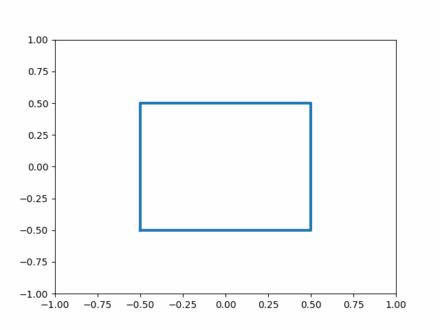

# MCCDataGeneration
- This repository is used to generate the training data for our upcoming physics-constrained neural network training.
- The code is based on the modified Cam-Clay model.

## Yield function

## Initial volum 

## Elastic modulus

## Gaussian process
- kernel function

- Gaussian function

- Covariance Matrix

- 

- Gaussian random loading path
Gaussian random loading path          |  Deformation of the configuration
:-------------------------:|:------------------------------------:
  |  

## Results of the simulation
Assuming that the loading will end up in the critical state.

## Size of the yield surface controlled by the hardening variable in the yield function

